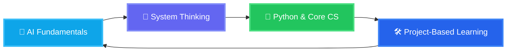

<!-- Header with animated typing effect -->
<div align="center">
 
</div>

<!-- Professional Banner -->
<div align="center">
  
</div>


<!-- About Section -->
<div align="center">
  <h2>🧠 About Me</h2>
  <p>
    
    
    
  </p>
</div>

<!-- Quote Section -->
<div align="center">
  
</div>

---

## 💫 What Drives Me

```python
class AyushmanGupta:
    def __init__(self):
        self.background = "Computer Science (AI & ML)"
        self.identity = "AI & Software Engineering Enthusiast"
        self.philosophy = "Clarity before complexity"
        self.interests = [
            "Artificial Intelligence",
            "System Design",
            "Problem Solving",
            "Game-based Learning"
        ]
        self.current_focus = "Building practical, explainable AI systems"
    
    def daily_routine(self):
        return [
            "📖 Learn deeply",
            "🧠 Break problems down",
            "🛠️ Build clean solutions",
            "🔁 Improve & iterate"
        ]
    
    def fun_fact(self):
        return "I enjoy debugging systems more than overthinking conversations 🙂"
```

---

## 🎯 What I Do

<div align="center">
  <table>
    <tr>
      <td align="center" width="33%">
        
        <h3>🔧 Software Development</h3>
        <p>Designing and building clean, structured programs using Python and core
          computer science principles.</p>
      </td>
      <td align="center" width="33%">
        
        <h3>🤖 AI & Intelligent Systems</h3>
        <p> Working on AI-driven systems such as agents, RAG pipelines, and logic-based
          analysis with a focus on explainability.</p>
      </td>
      <td align="center" width="33%">        
        
        <h3>🎮 Learning by Building</h3>
        <p>Creating project-based and game-inspired systems to understand concepts
          deeply and make learning engaging.</p>
      </td>
    </tr>
  </table>
</div>

---

## 🛠️ Tech Arsenal

<div align="center">

### 💻 Languages & Frameworks


### 🤖 AI & ML - Generative AI


### 🗄️ Databases & Storage


### ☁️ Cloud & DevOps (Foundational)

-2496ED?style=for-the-badge&logo=docker&logoColor=white)
-FCC624?style=for-the-badge&logo=linux&logoColor=black)
-F05032?style=for-the-badge&logo=git&logoColor=white)
-232F3E?style=for-the-badge&logo=amazon-aws&logoColor=white)
-4285F4?style=for-the-badge&logo=google-cloud&logoColor=white)
-000000?style=for-the-badge&logo=yaml&logoColor=white)


### 🔧 Tools & Technologies (Daily Use)

-F05032?style=for-the-badge&logo=git&logoColor=white)
-FCC624?style=for-the-badge&logo=linux&logoColor=black)
-FF6C37?style=for-the-badge&logo=postman&logoColor=white)
-007ACC?style=for-the-badge&logo=visual-studio-code&logoColor=white)
-181717?style=for-the-badge&logo=github&logoColor=white)

</div>

---

## 📊 GitHub Analytics

<div align="center">
  
  <br/><br/>
</div>

---

<div align="center">
  
</div>

---

## 🌐 Connect & Follow My Journey

<div align="center">
  
### 📱 Social Media
[](https://www.linkedin.com/in/ayushmangupta21/)

### 📧 Let's Collaborate
[](mailto:guptaayushman176@gmail.com)

</div>

---

## 📚 Content & Learning

<div align="center">
  <table>
    <tr>
      <td align="center">
        
        <br><strong>AI & ML Learning</strong>
        <br>Studying AI concepts by building practical systems and experiments
        <br><em>Hands-on • Concept-first</em>
      </td>
      <td align="center">
        
        <br><strong>Project-Based Learning</strong>
        <br>Understanding computer science and AI through real-world projects
        <br><em>Build → Break → Improve</em>
      </td>
      <td align="center">
        
        <br><strong>Self Study & Research</strong>
        <br>Learning from documentation, papers, and deep technical resources
        <br><em>Depth over speed</em>
      </td>
    </tr>
  </table>
</div>


---

## 🎯 Current Focus



---

## 💡 Philosophy

<div align="center">
  
</div>


> **"If it's structured, it can be automated"** - This drives my approach to solving complex problems through elegant, scalable solutions.

---

<div align="center">
  

  
  ### 🚀 Ready to build something amazing together?
  
  

  
  **⭐ Star my repositories if you find them helpful!**
  
</div>
