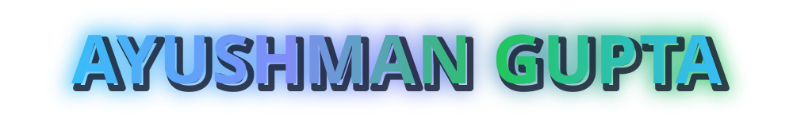
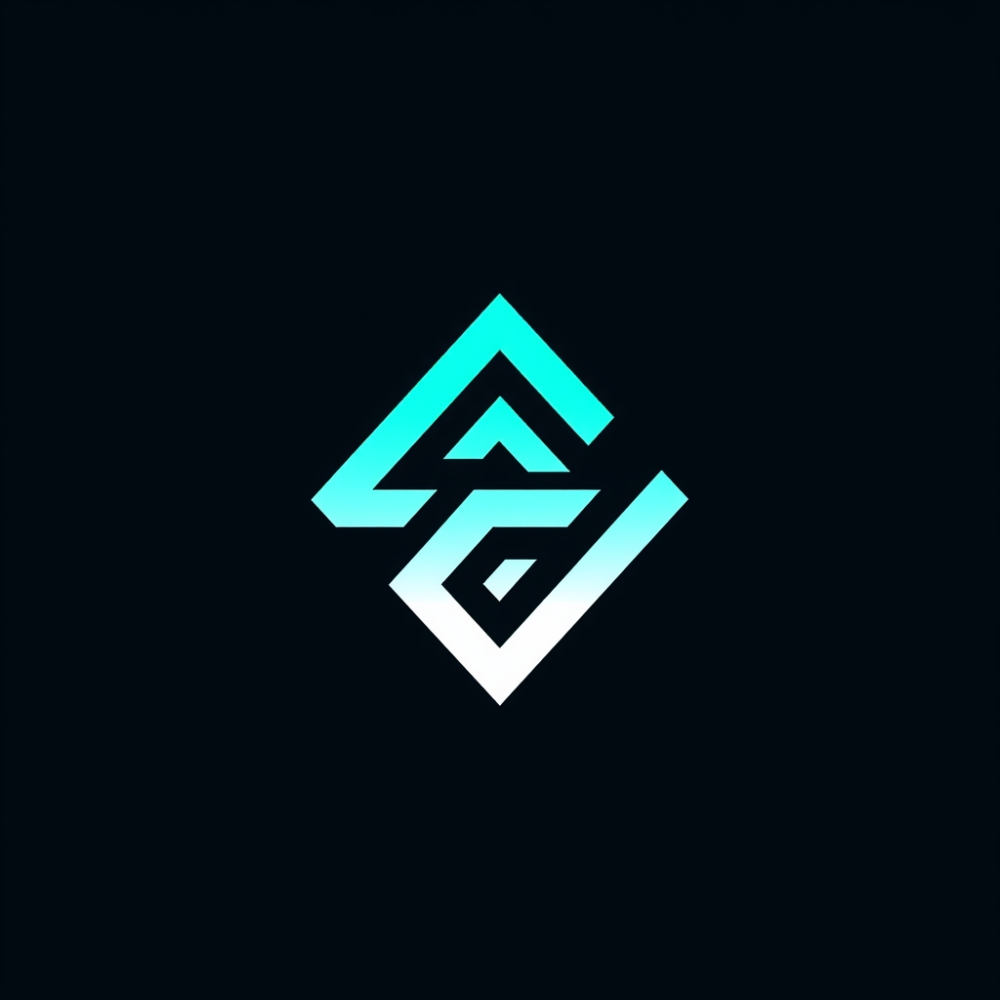

  

<!-- About Section -->

   
  
  

    
    
    
  

<!-- Quote Section -->

  

---

##  What Drives Me

  

---

##  What I Do

  
  

---

##  Tech Arsenal

  
  

  

  

  
  

  

  

  
  

  

  

---

##  Featured Projects - Built With Passion

<table>
<tr>
<td width="50%" valign="top">

###  [ WebLy ](https://github.com/AyushmanGupta21/WebLy)

**AI-powered website builder**

• Transforms ideas to professional websites  
• Instant Generation via plain English  
• Fully functional & scalable outputs  

`TypeScript` `Generative AI` `WebDev` `AI Agents`

</td>
<td width="50%" valign="top">

###  [ HireNexa ](https://github.com/AyushmanGupta21/HireNexa)

 

**Decentralized recruitment on Celo**

• AI converts GitHub activity to Portfolio NFTs  
• Military-grade encryption & on-chain verification  
• Smart Contract automated hiring flow  

`TypeScript` `Web3` `Smart Contracts` `Celo`

</td>
</tr>

<tr>
<td width="50%" valign="top">

###  [ FairDeal ](https://github.com/AyushmanGupta21/FairDeal)

 

**Blockchain escrow platform**

• Stellar smart contracts & IPFS file storage  
• Automated payment release flow  
• Zero platform fees, maximum trust  

`TypeScript` `Blockchain` `Stellar` `IPFS`

</td>
<td width="50%" valign="top">

###  [ Parallax ](https://github.com/AyushmanGupta21/Parallax)

 

**Universal Stellar Oracle**

• Real-time aggregated asset feeds  
• Smart contract interactions via Soroban  
• Seamless portfolio management  

`TypeScript` `Web3` `Stellar` `Soroban`

</td>
</tr>
</table>

---

##  GitHub Analytics

  
    

---

  

---

##  Connect & Follow My Journey

  
###  Social Media

###  Let's Collaborate

---

##  Content & Learning

  <table border="0" cellpadding="0" cellspacing="0">
    <tr>
      <td align="center">
        
         <strong>AI & ML Learning</strong>
         Studying AI concepts by building practical systems and experiments
         <em>Hands-on • Concept-first</em>
      </td>
      <td align="center">
        
         <strong>Project-Based Learning</strong>
         Understanding computer science and AI through real-world projects
         <em>Build → Break → Improve</em>
      </td>
      <td align="center">
        
         <strong>Self Study & Research</strong>
         Learning from documentation, papers, and deep technical resources
         <em>Depth over speed</em>
      </td>
    </tr>
  </table>

---

##  Current Focus

  

---

##  Philosophy

  

> **"If it's structured, it can be automated"** - This drives my approach to solving complex problems through elegant, scalable solutions.

---

  

  
  ###  Ready to build something amazing together?
  
  

  
  ** Star my repositories if you find them helpful!!**
  

